.. -----------------------------------------------------------------------------
   ..
   ..  Filename       : index.rst
   ..  Author         : Huang Leilei
   ..  Status         : phase 000
   ..  Created        : 2026-09-17
   ..  Description    : description about 第00讲 - 课程简介
   ..
.. -----------------------------------------------------------------------------

第00讲 - 课程简介
--------------------------------------------------------------------------------

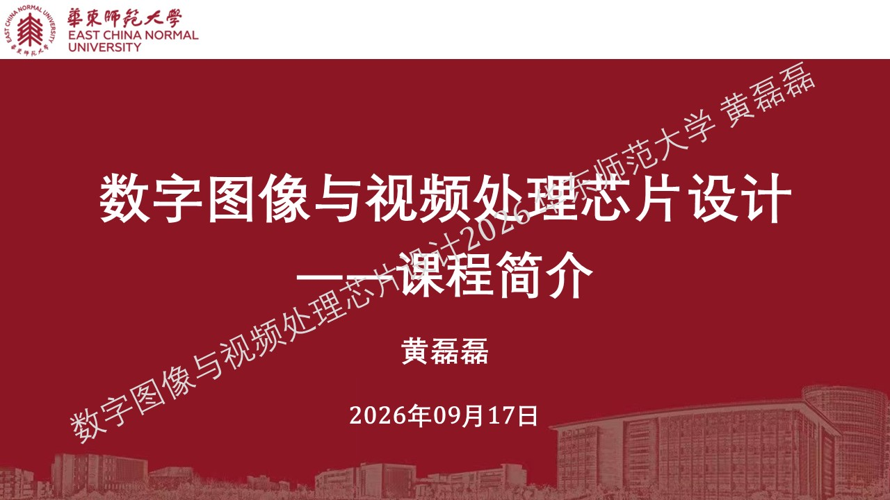

内容导入 & 学习意义
........................................
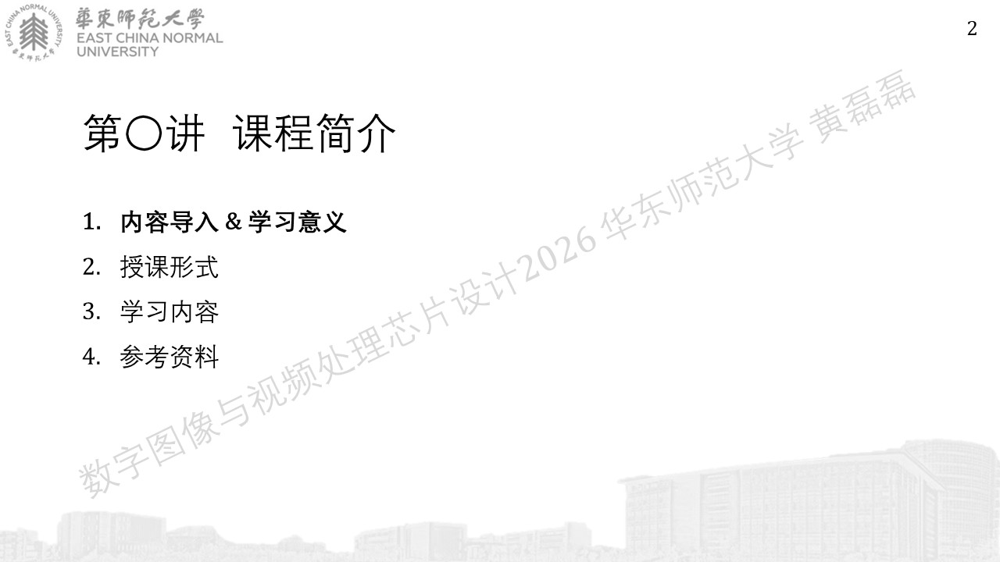
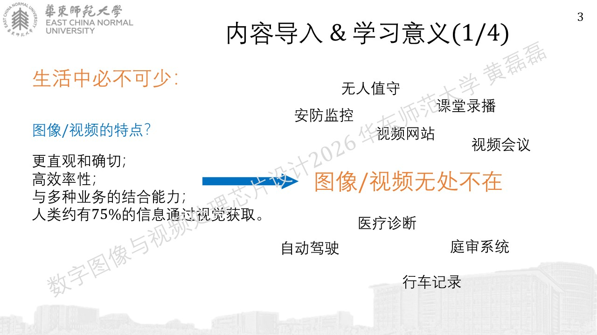
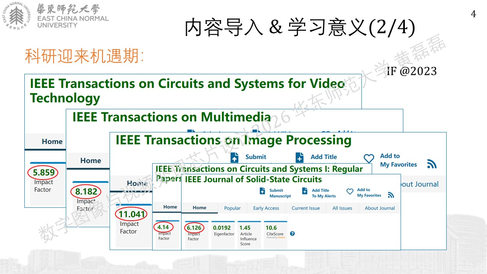
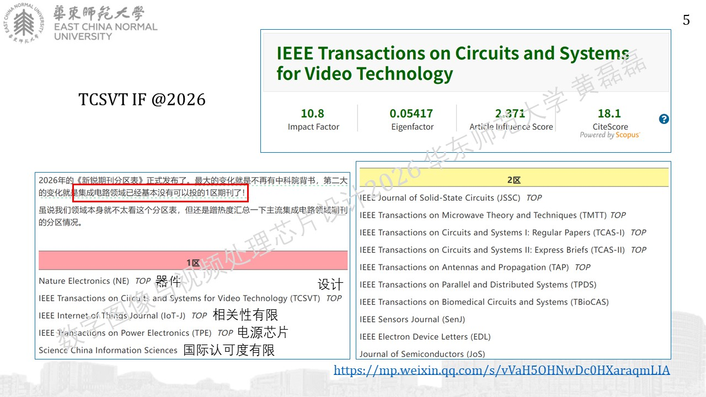

https://mp.weixin.qq.com/s/vVaH5OHNwDc0HXaraqmLIA

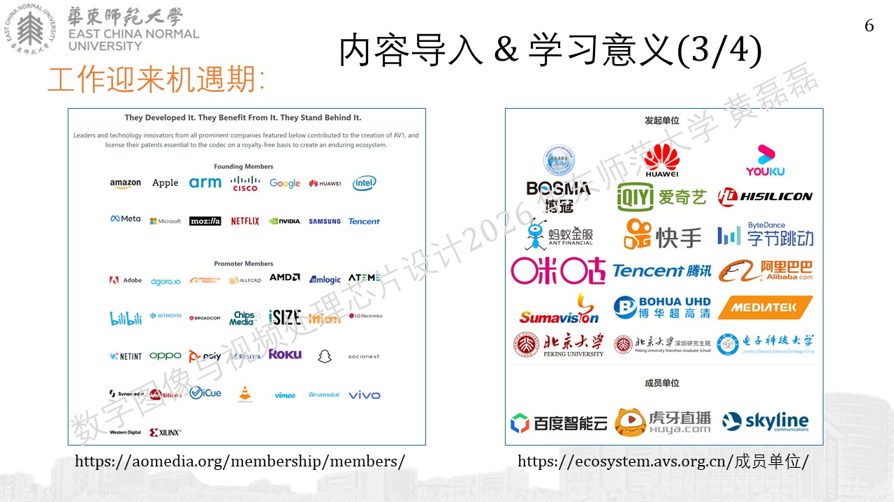

https://aomedia.org/membership/members/
https://ecosystem.avs.org.cn/成员单位/

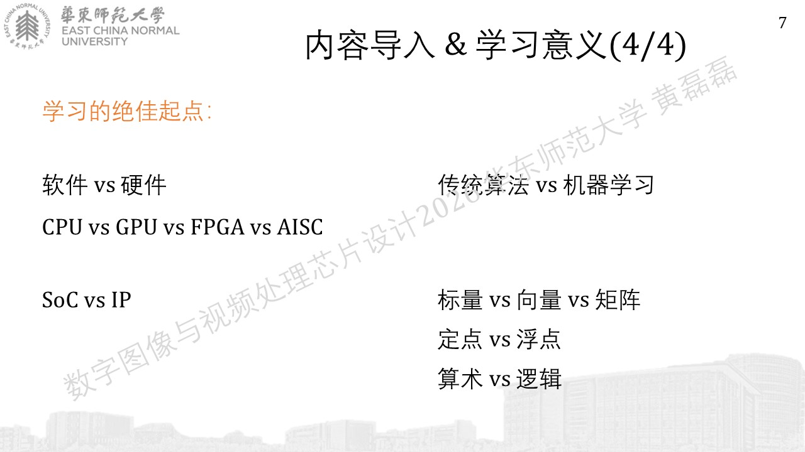

授课形式
........................................
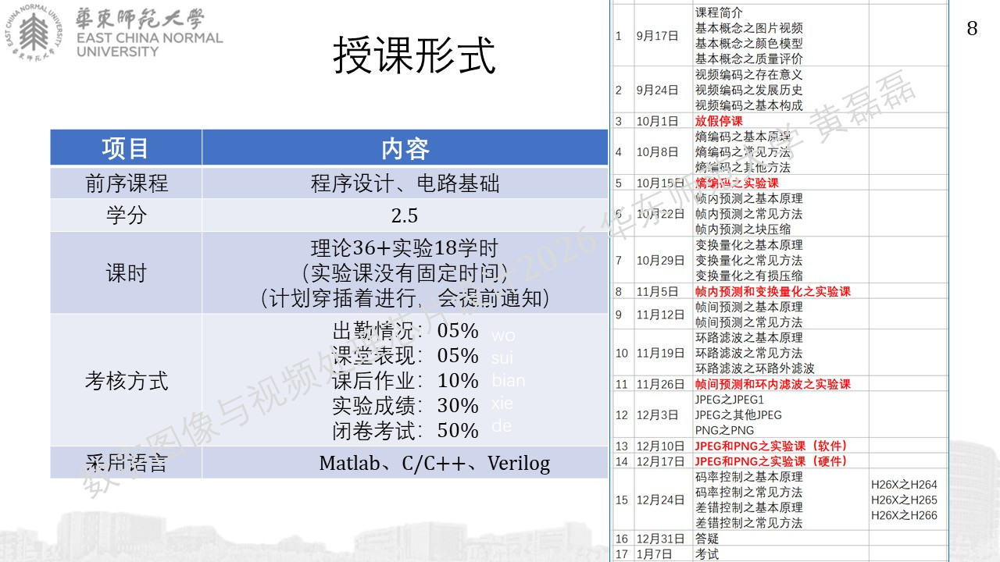

学习内容
........................................
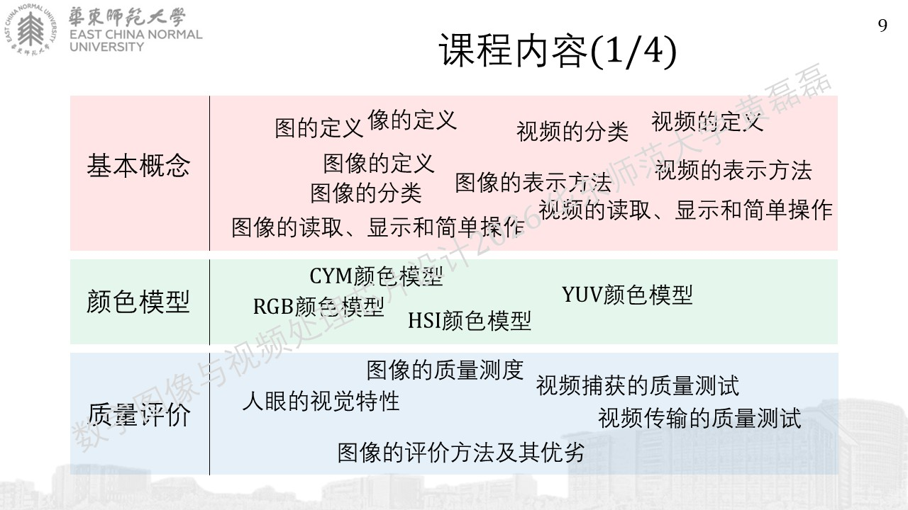
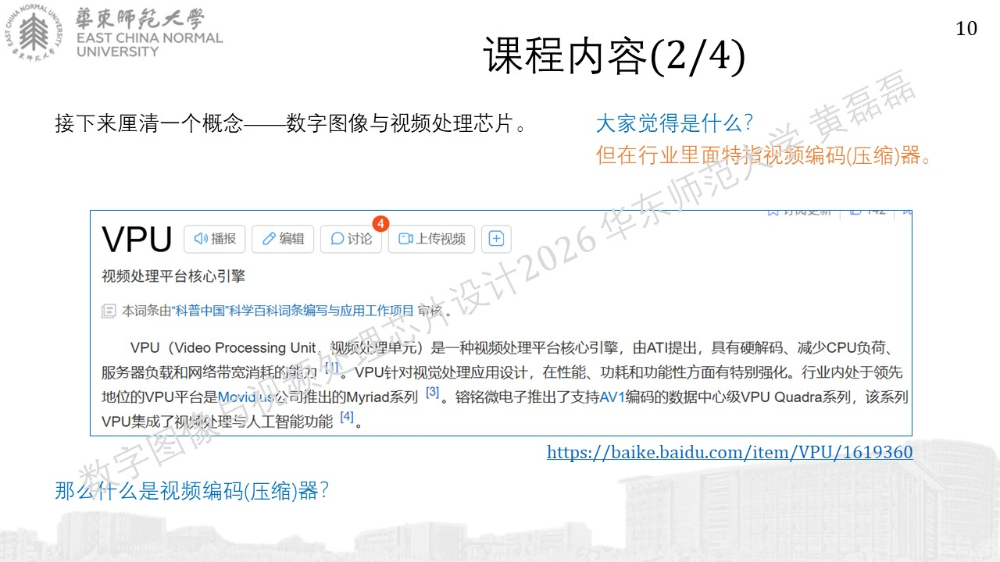

https://baike.baidu.com/item/VPU/1619360

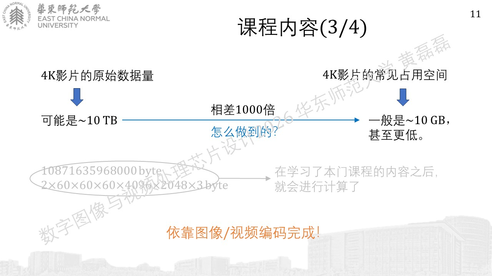
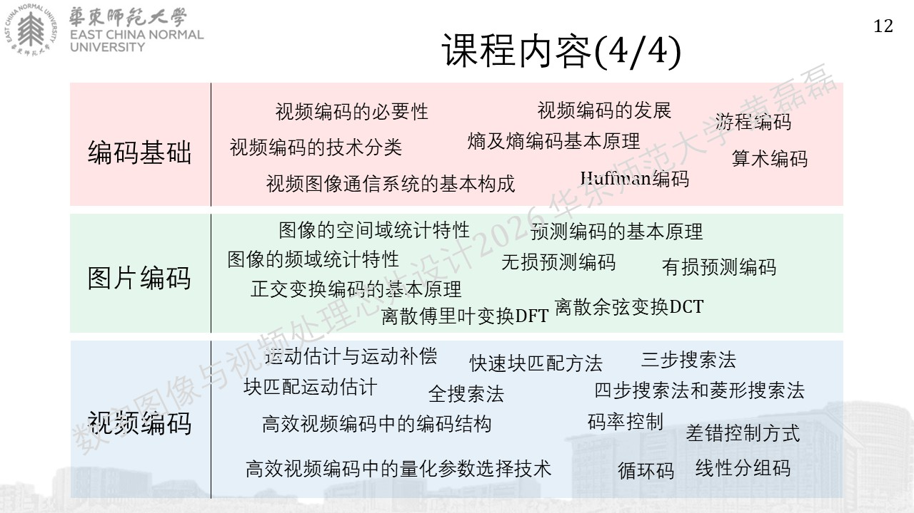

参考资料
........................................
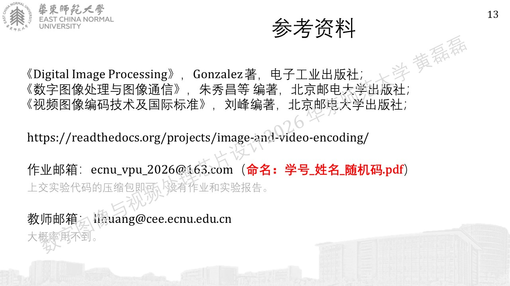
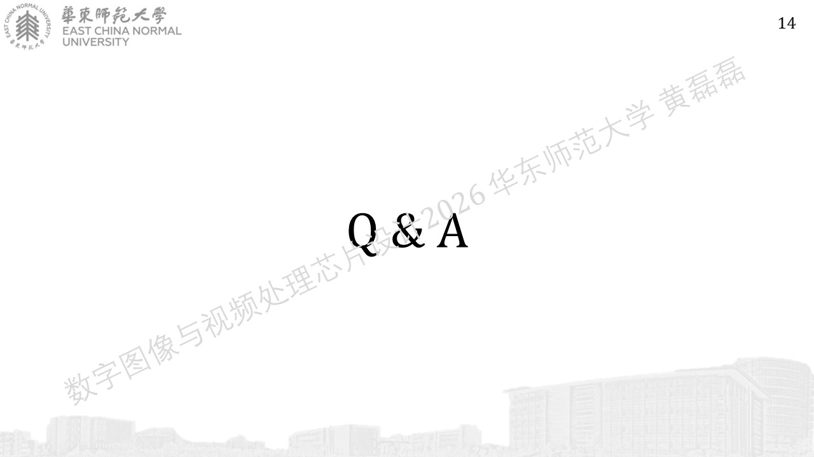

|  ecnu_vpu_2026@163.com
|  llhuang@cee.ecnu.edu.cn
