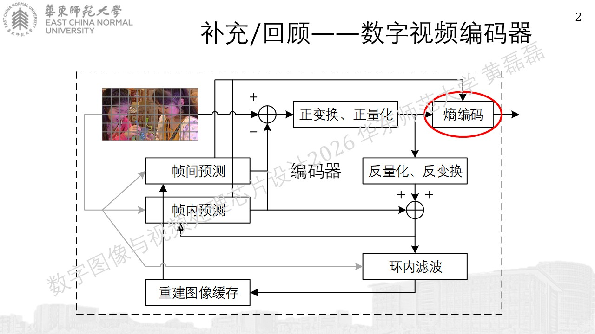
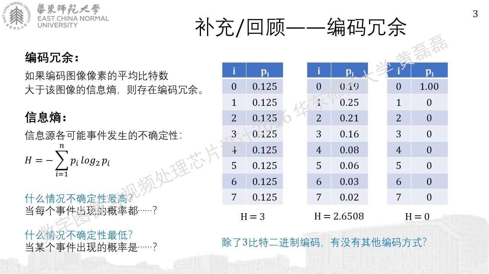
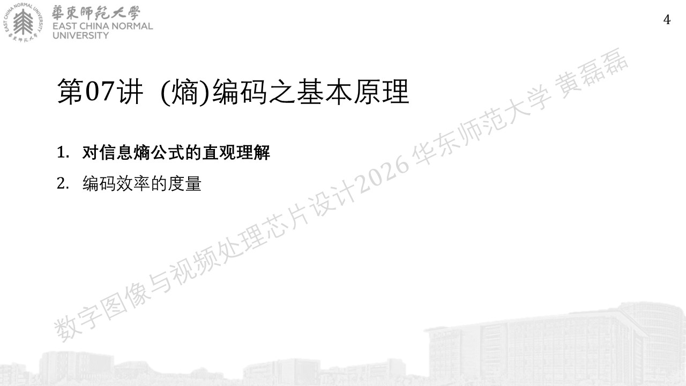
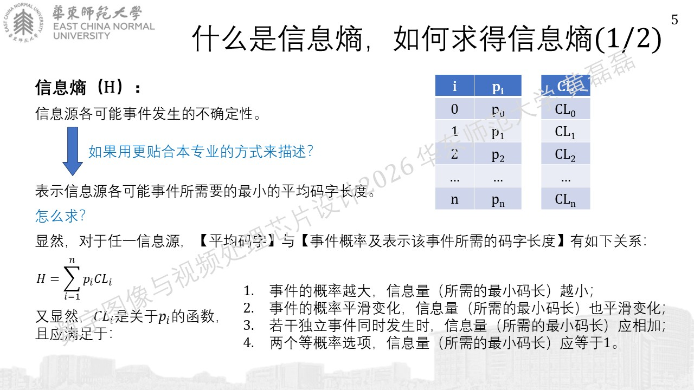
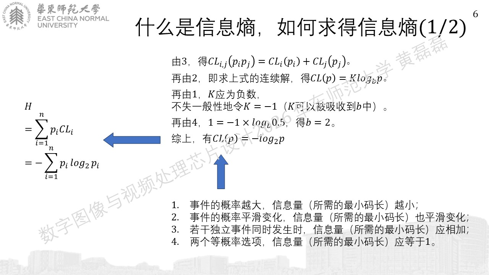
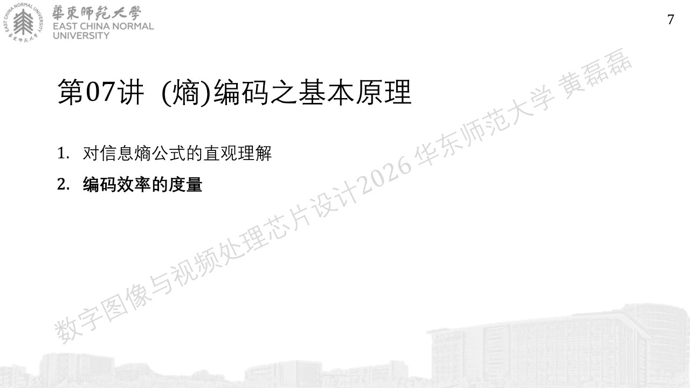
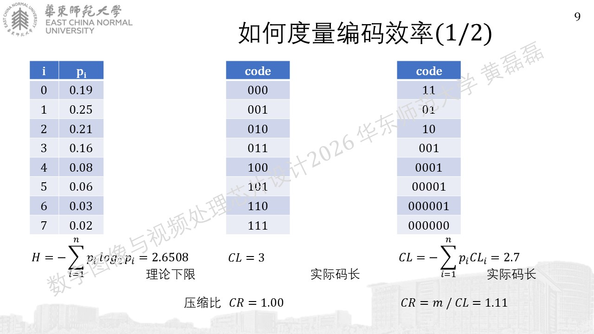
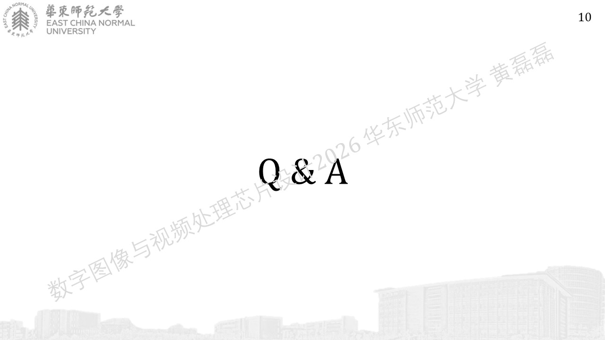

.. -----------------------------------------------------------------------------
   ..
   ..  Filename       : index.rst
   ..  Author         : Huang Leilei
   ..  Status         : phase 000
   ..  Created        : 2026-09-17
   ..  Description    : description about 第07讲 - (熵)编码 - 基本原理
   ..
.. -----------------------------------------------------------------------------

第07讲 - (熵)编码 - 基本原理
--------------------------------------------------------------------------------

导入
........................................

对信息熵公式的直观理解
........................................

编码效率的度量
........................................

